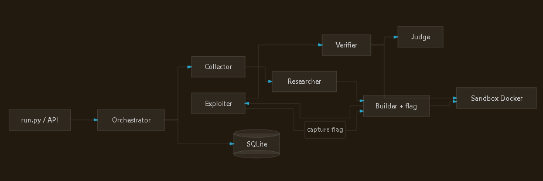

# KAVACH

**Knowledge-driven Autonomous Vulnerability Analysis & Containment Hub**

KAVACH is an agentic security research pipeline for **authorized** CVE analysis.
Give it a CVE ID and it collects intelligence, reasons about attack surface,
builds a sandboxed repro, and — in offensive mode — runs an LLM-driven HTTP
exploit loop with adaptive discovery. Success is judged on **observable proof**
(flag capture, file read, shell output) — not plugin-discovery false positives.

> **Use responsibly.** Offensive mode only runs against loopback/private lab hosts,
> explicit allowlist entries, or targets you confirm with `--authorized-target`.

---

## What it does

| Mode | Pipeline | Output |
|------|----------|--------|
| **Defensive** | Collector → Researcher → Builder → Verifier → Judge | Research memo, sandbox verification, report |
| **Offensive** | … → **Exploiter** → Verifier → Judge | Runnable PoC + evidence-backed verdict |

### Agent roles

```
defensive: Collector ─► Researcher ─► Builder ─► Verifier ─► Judge
offensive: Collector ─► Researcher ─► Builder ─► Exploiter ─► Verifier ─► Judge
```

| Agent | Role |
|-------|------|
| **Collector** | CVE metadata from NVD (or offline samples): CVSS, CWE, affected versions, references |
| **Researcher** | Classify the bug, map primitives, propose detection ideas |
| **Builder** | Pinned Docker repro + benign harness; plants a secret flag in bundled labs |
| **Exploiter** | LLM HTTP loop: recon → plan → execute → adaptive discovery → iterate |
| **Verifier** | Vulnerable vs. patched twins in a hardened sandbox |
| **Judge** | Actor-critic synthesis → verdict (`exploited` / `confirmed` / `likely` / …) |

Full design: [`docs/ARCHITECTURE.md`](docs/ARCHITECTURE.md)

---

## Architecture

High-level system diagram — from CLI/API entry through orchestration, agents,
web intel, exploitation, verification, and sandboxed output:



| Component | Purpose |
|-----------|---------|
| **run.py / API** | CLI and REST entrypoints |
| **Orchestrator** | Wires agents, persists run state to SQLite |
| **Collector** | CVE metadata (NVD or offline samples) |
| **Researcher** | Classify vuln, map primitives, detection ideas |
| **Builder + flag** | Docker repro, benign harness, planted lab secret |
| **Exploiter** | LLM HTTP loop with adaptive discovery |
| **Verifier** | Vulnerable vs. patched twin in hardened sandbox |
| **Judge** | Evidence-backed verdict synthesis |
| **Sandbox Docker** | Isolated verification environment |
| **SQLite** | Full audit trail per run |

Offensive runs also pull **Web Intel** (SerpAPI) before the Exploiter — see below.

---

## Quick start (offline, zero API keys)

The core pipeline runs on the Python standard library in **mock mode**:

```bash
git clone https://github.com/choudharyrajritu1/kavach.git
cd kavach
python run.py CVE-2021-44228            # Log4Shell (bundled sample)
python run.py CVE-2014-0160 --json      # Heartbleed, full JSON state
python run.py --lab                     # bundled command-injection lab → captures flag
python run.py CVE-2099-00001 --auto     # auto recipe + exploit bundled lab (offline)
```

Run tests:

```bash
python -m unittest discover -s tests
```

---

## Validated results (real runs)

KAVACH has been tested end-to-end on live CVEs with **EXPLOITED** verdicts.
Browse sanitized logs and proof snippets so you know what success looks like:

| CVE | Verdict | Details |
|-----|---------|---------|
| **CVE-2025-29927** | EXPLOITED | [Next.js middleware bypass](docs/results/CVE-2025-29927.md) · [log](docs/results/logs/CVE-2025-29927-success.log) |
| **CVE-2021-42013** | EXPLOITED | [Apache 2.4.50 RCE bypass](docs/results/CVE-2021-42013.md) · [log](docs/results/logs/CVE-2021-42013-success.log) |

More commands: [`docs/EXAMPLE_RUNS.md`](docs/EXAMPLE_RUNS.md) · Index: [`docs/results/README.md`](docs/results/README.md)

**Featured proof (CVE-2025-29927)** — protected endpoint returns 401, KAVACH bypasses with:

```http
GET /api/hello HTTP/1.1
Host: 127.0.0.1:3300
x-middleware-subrequest: middleware:middleware:middleware:middleware:middleware
```

→ `200` with `{"message":"Hello, World"}` · Judge: **EXPLOITED** (confidence 0.95)

---

## Auto mode — CVE in, validated exploit out

`--auto` runs collect → **research swarm** (LEAD → CONTRARIAN → VERIFIER) →
auto-generated recipe → exploit → verify → judge. No hand-written JSON required:

```bash
python run.py CVE-2099-00001 --auto
python run.py CVE-2021-44228 --auto --target https://my-lab.internal/ --authorized-target
```

With a live LLM the swarm writes the recipe; in mock/offline mode a heuristic
recipe keeps the pipeline end-to-end. Supply `--target` or use the bundled lab.

---

## Offensive mode (authorized targets only)

```bash
# Loopback / RFC1918 — treated as lab (no extra flag):
python run.py CVE-2099-00001 --target http://127.0.0.1:8080/

# External host — requires explicit authorization:
python run.py CVE-2021-44228 --target https://my-lab.internal/ --authorized-target

# Structured CVE JSON for full operator control:
python run.py --cve-json data/examples/lab_command_injection.json
```

### Authorization policy

Exploitation is **refused** unless the target is:

- loopback or private (RFC1918) address, **or**
- listed in `KAVACH_TARGET_ALLOWLIST`, **or**
- confirmed with `--authorized-target`

---

## Live LLM mode

```bash
cp .env.example .env   # edit values — never commit .env
export KAVACH_LLM_MODE=live KAVACH_PROVIDER=Together TOGETHER_API_KEY=...
python run.py CVE-2021-44228
```

Providers: **Together**, **Cerebras**, **Fireworks**, or any **Local** OpenAI-compatible server
(vLLM / Ollama / LM Studio).

---

## Web intel (SerpAPI)

KAVACH uses **[SerpAPI](https://serpapi.com/)** to run a targeted Google search
before the Exploiter (offensive mode). Public PoC write-ups, advisories, and
blog snippets are mined for probe paths, request headers, techniques, and success
markers — so the LLM exploit loop starts with real-world context instead of
guessing blindly.

**When it runs:** automatically in offensive pipelines when `SERPAPI_API_KEY` is set.
Without a key, the pipeline still works (mock/heuristic intel in offline mode).

**Setup:**

```bash
# In .env (get a key at https://serpapi.com/manage-api-key)
SERPAPI_API_KEY=your_serpapi_key_here

# Optional: test the search client directly
python scripts/google_search.py "CVE-2021-44228 exploit PoC"
```

**What gets extracted** (`kavach/search/intel.py`):

- Probe paths (`/api/...`, plugin routes, etc.)
- Request headers mentioned in write-ups
- Techniques and success markers
- Reference URLs and raw snippets (fed to the Exploiter LLM)

SerpAPI is listed in `requirements.txt` (`serpapi==1.0.2`). It is **optional**
for offline demos and CI — only needed for live web-intel enrichment on real CVEs.

---

## API service

```bash
pip install -r requirements.txt
uvicorn kavach.api.main:app --reload
```

```bash
curl -s localhost:8000/healthz
curl -s -X POST localhost:8000/api/analyze \
     -H 'content-type: application/json' \
     -d '{"cve_id":"CVE-2021-44228"}' | jq
```

Full stack (API + Postgres + Qdrant):

```bash
docker compose up --build
```

---

## Safety model

KAVACH is built for **defensive security research** and **authorized pentesting**:

- **Target gate** — non-lab hosts blocked unless explicitly authorized
- **Guardrails** — generated artifacts scanned for weaponized patterns (reverse
  shells, fork bombs, etc.); matches are redacted and flagged for review
- **Sandbox** — Verifier runs with `--network none`, `--read-only`,
  `--cap-drop ALL`, seccomp, memory/PID limits, non-root user
- **Human review** — `KAVACH_HUMAN_REVIEW=true` gates final reports
- **Audit trail** — full run state in SQLite (`data/kavach.db`)

Defensive mode never generates exploits or touches live targets.

---

## Configuration

Key environment variables (see [`.env.example`](.env.example)):

| Variable | Default | Description |
|----------|---------|-------------|
| `KAVACH_MODE` | `defensive` | `offensive` enables Exploiter |
| `KAVACH_LLM_MODE` | `mock` | `live` for real LLM calls |
| `KAVACH_PROVIDER` | `Together` | LLM backend |
| `KAVACH_EXPLOIT_MAX_ITERATIONS` | `3` | Exploiter loop cap |
| `KAVACH_TARGET_ALLOWLIST` | — | Comma-separated authorized hosts |
| `KAVACH_SANDBOX_ENABLED` | `false` | Hardened Docker verification |
| `SERPAPI_API_KEY` | — | Google search intel via [SerpAPI](https://serpapi.com/) (offensive mode) |

---

## Project layout

```
kavach/
├── run.py                  # CLI entrypoint
├── requirements.txt
├── Dockerfile, docker-compose.yml, .env.example
├── docs/
│   ├── assets/
│   │   └── architecture.png  # system diagram (also in README)
│   ├── ARCHITECTURE.md
│   ├── CVE_INPUT.md
│   ├── EXAMPLE_RUNS.md       # copy-paste commands per CVE
│   └── results/              # validated EXPLOITED runs + sanitized logs
│       ├── README.md
│       ├── CVE-2025-29927.md
│       ├── CVE-2021-42013.md
│       └── logs/
├── kavach/                 # Python package
│   ├── config.py
│   ├── orchestrator.py
│   ├── agents/             # collector, researcher, builder, exploiter, verifier, judge
│   ├── exploit/            # LLM generator, discovery, evidence, signals
│   ├── search/             # web intel (SerpAPI)
│   ├── lab/                # bundled vulnerable fixtures
│   ├── sandbox/            # hardened Docker runner
│   └── prompts/
├── data/examples/          # sample CVE JSON recipes
├── schemas/                # cve_exploit_input JSON schema
└── tests/
```

---

## Scope (honest limits)

The Exploiter is an **LLM-driven HTTP loop** — not a hand-coded PoC per CVE.
It covers web/API vulnerability classes with adaptive path discovery. It does
**not** handle memory corruption or non-HTTP exploitation.

---

## License

MIT — see [LICENSE](LICENSE).

---

## Contributing

Issues and PRs welcome. Please only test offensive mode against systems you own
or have written permission to assess.
