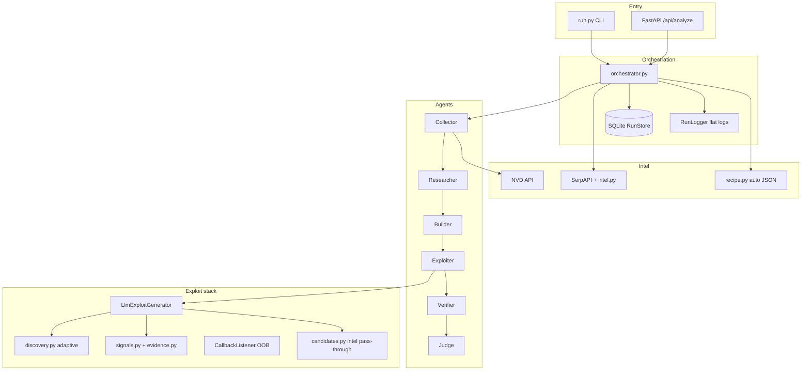

# KAVACH — Architecture & Workflow

KAVACH is an **agentic CVE analysis pipeline** that can run in **defensive**
mode (benign verification + report) or **offensive** mode (authorized live HTTP
exploitation with evidence-based proof). It is designed for **real authorized
targets** — not just bundled labs — using an LLM-driven exploit loop, web intel,
adaptive discovery, and strict false-positive controls.


---

## 1. High-level flow

### Defensive pipeline

```
CLI/API  →  Orchestrator  →  Collector → Researcher → Builder → Verifier → Judge
```

### Offensive pipeline (authorized targets)

```
CLI/API  →  Orchestrator  →  Collector → Researcher → Builder
                              ↓
                         [Web Intel]  (Google/SerpAPI, before Exploiter)
                              ↓
                         Exploiter  (LLM loop + adaptive discovery)
                              ↓
                         Verifier → Judge
```

### Optional front half (`--auto`)

When you pass only a CVE id (no hand-written JSON):

```
CVE id  →  Collector → Researcher → AutoRecipeGenerator (LEAD/CONTRARIAN/VERIFIER swarm)
         →  validated cve_exploit_input JSON  →  same offensive pipeline
```

---

## 2. End-to-end workflow (what happens when you run)

Example:

```bash
python run.py CVE-2023-3452 --auto \
  --target https://lab.example/ --authorized-target
```

| Step | Agent / module | What it does |
|------|----------------|--------------|
| 1 | **Orchestrator** | Creates `PipelineState`, SQLite row, flat log file `data/runs/{cve}_{date}_{time}.log` |
| 2 | **Collector** | Fetches CVE from NVD (live) or offline samples; builds `CVEContext` |
| 3 | **Researcher** | Classifies vuln class, root cause, primitives, detection ideas → `ResearchMemo` |
| 4 | **Builder** | Docker/harness artifact; plants `KAVACH_FLAG{...}` **only** for bundled lab / explicit JSON flag |
| 5 | **Web Intel** | One Google search (SerpAPI) → paths, headers, snippets → `state.web_intel` |
| 6 | **Exploiter** | Recon → LLM plans → HTTP execution → adaptive discovery → iterate until success or max iterations |
| 7 | **Verifier** | Sandbox dry-run or Docker twin check (skipped in exploit-only mode) |
| 8 | **Judge** | Verdict + confidence; **exploited** only with strong proof (not discovery) |
| 9 | **Persistence** | Full state JSON in `data/kavach.db`; report via CLI `--save` or API |

---

## 3. Exploiter deep dive (adaptive loop)

The Exploiter is **not** a single hardcoded PoC per CVE. It uses
`LlmExploitGenerator` for generic HTTP exploitation.

### Per-iteration loop

```
┌─────────────────────────────────────────────────────────────┐
│  Iteration N (up to KAVACH_EXPLOIT_MAX_ITERATIONS, default 3)  │
├─────────────────────────────────────────────────────────────┤
│  1. Build prompt: CVE context + recon + web intel +         │
│     prior failures + adaptive discovery hints               │
│  2. LLM → JSON plan (url / steps / candidates[])             │
│  3. Repair passes if JSON invalid                           │
│  4. Merge intel + adaptive candidates                       │
│  5. Execute each candidate; first strong proof wins         │
│  6. Adaptive discovery on failure (same iteration):         │
│     - Parse per-candidate status (200/404/500)              │
│     - Re-fetch directory listings                           │
│     - Extract sibling .php from HTML/Index of               │
│     - Reuse injection params from prior URLs                │
│     - Auto-run follow-up candidates                         │
│  7. Update recon.adaptive_candidates for next iteration      │
│  8. On success → stop; else feed errors into prior[]         │
└─────────────────────────────────────────────────────────────┘
```

### Proof model (real websites)

| Target type | Success proof |
|-------------|----------------|
| Bundled lab | `KAVACHCAP[...]KAVACHEND` capture marker + planted `KAVACH_FLAG{...}` |
| **Real authorized URL** | Observable evidence only: passwd contents, `uid=` shell output, wp-config secrets, flag patterns (`FLAG{...}`), OOB callback |
| **Not proof** | Plugin readme, directory listing, generic HTML, plugin name in body |

Implemented in `exploit/evidence.py`, `exploit/signals.py`, `agents/judge.py`.

---

## 4. Component diagram



---

## 5. File map — what each module does

### Entry & config

| File | Role |
|------|------|
| `run.py` | CLI: CVE id, `--target`, `--authorized-target`, `--auto`, `--cve-json`, `--lab`, `--json`, `--save` |
| `kavach/config.py` | Env-driven config: LLM provider, mode, iterations, SerpAPI, sandbox, paths |
| `.env` | `KAVACH_LLM_MODE`, `KAVACH_MODE`, `TOGETHER_API_KEY`, `SERPAPI_API_KEY`, etc. |

### Orchestration & state

| File | Role |
|------|------|
| `orchestrator.py` | Runs agent pipeline; web intel before Exploiter; auto-recipe; retries |
| `schemas.py` | `PipelineState`, `CVEContext`, `ExploitResult`, `JudgeReport`, stages |
| `database.py` | SQLite persistence of full run state (`data/kavach.db`) |
| `logging_utils.py` | Flat run logs: `data/runs/cve-xxx_YYYY-MM-DD_HH-MM-SS.log` |

### Agents (`kavach/agents/`)

| File | Role |
|------|------|
| `collector.py` | NVD/offline CVE fetch → `CVEContext` |
| `researcher.py` | Vuln classification, root cause, primitives → `ResearchMemo` |
| `builder.py` | Repro Dockerfile/harness; flag planting for lab only |
| `exploiter.py` | Authorization gate; recon; LLM iterate loop; adaptive discovery wiring |
| `verifier.py` | Vulnerable vs patched sandbox signals |
| `judge.py` | Final verdict; **exploited** only with `assess_exploit_evidence_strength` |
| `base.py` | Shared agent base + prompt loading |

### CVE input & auto recipe

| File | Role |
|------|------|
| `cve_input.py` | Parse/validate operator JSON (`CVEExploitInput`); attack surface, signals, hints |
| `recipe.py` | `AutoRecipeGenerator`: LLM swarm or heuristic → `cve_exploit_input` dict |
| `schemas/cve_exploit_input.schema.json` | JSON schema for operator/CVE recipes |
| `data/examples/*.json` | Lab recipes (command injection, Next.js, Apache traversal, etc.) |

### Exploit framework (`kavach/exploit/`)

| File | Role |
|------|------|
| `llm_generator.py` | LLM plan/execute; multi-step chains; candidate batches; recon; JSON repair |
| `discovery.py` | **Adaptive discovery**: triage 200/404, directory listings, sibling PHP, param reuse |
| `candidates.py` | Dedupe/merge LLM `candidates[]` batches |
| `signals.py` | Evaluate success/failure signals from JSON + LLM markers |
| `evidence.py` | Proof gate: reject readme/discovery; accept passwd/RCE/flag patterns |
| `callback.py` | Local OOB HTTP listener for blind SSRF/RCE/JNDI |
| `base.py` | `ModuleResult` dataclass |

### Search & intel

| File | Role |
|------|------|
| `search/intel.py` | SerpAPI → `WebIntel` (paths, headers, snippets); enriches `cve_input` hints |
| `search/google.py` | Google search client |

### Safety & LLM

| File | Role |
|------|------|
| `safety.py` | `authorize_target()`; weaponized pattern scan/redact on reports |
| `llm_client.py` | OpenAI-compatible client + `MockChatModel` for CI/offline |

### Lab & sandbox

| File | Role |
|------|------|
| `lab/vulnerable_app.py` | Bundled command-injection HTTP lab (`CVE-2099-00001`) |
| `lab/LabServer` | In-process vulnerable/patched twins for tests |
| `sandbox/runner.py` | Hardened Docker verifier |
| `sandbox/seccomp.json` | Syscall allowlist |

### Prompts (`kavach/prompts/`)

| File | Used by |
|------|---------|
| `exploiter.txt` | Exploiter LLM system prompt (technique playbook) |
| `exploiter_enumerate.txt` | Candidate enumeration / JSON repair |
| `judge.txt` | Judge synthesis |
| `recipe.txt` | Auto-recipe swarm |
| `web_intel_extractor.txt` | Google snippet → structured intel |
| `collector.txt`, `researcher.txt`, etc. | Other agents |

### API & tests

| File | Role |
|------|------|
| `api/main.py` | FastAPI: `/api/analyze`, run listing |
| `tests/` | 65+ unit/integration tests (exploit, discovery, evidence, pipeline) |

---

## 6. Data artifacts

| Path | Contents |
|------|----------|
| `data/kavach.db` | SQLite: `run_id`, CVE, stage, full `state_json` after each agent |
| `data/runs/*.log` | Verbose iteration logs (LLM plan, raw response, execution, adaptive discovery) |
| `PipelineState.report` | Final `JudgeReport`: verdict, confidence, remediation, FP checks |

---

## 7. Modes & CLI capabilities

### Modes

| Mode | Env | Exploiter | Typical use |
|------|-----|-----------|-------------|
| **Defensive** | `KAVACH_MODE=defensive` | Skipped | Research report, sandbox verification |
| **Offensive** | `KAVACH_MODE=offensive` or `--cve-json` / `--target` | Full LLM loop | Authorized pentest / lab validation |

### Input modes

| Input | Command pattern | Recipe source |
|-------|-----------------|---------------|
| CVE only | `python run.py CVE-2024-XXXX --target URL --authorized-target` | Web intel + LLM + recon |
| Auto recipe | `python run.py CVE-XXXX --auto --target URL --authorized-target` | Auto-generated JSON + pipeline |
| Operator JSON | `python run.py --cve-json path/to.json` | Your structured hints |
| Bundled lab | `python run.py --lab` or `CVE-2099-00001` | Built-in command-injection lab |

### Authorization (`safety.authorize_target`)

| Target | Result |
|--------|--------|
| `127.0.0.1`, `localhost`, RFC1918 | Allowed (`lab`) |
| `--authorized-target` or allowlist | Allowed (`authorized_url`) |
| Public internet without confirmation | **Blocked** |

---

## 8. Judge verdicts

| Verdict | When |
|---------|------|
| `exploited` | Offensive mode + **strong** live proof (flag exfil, file read, shell output, OOB) |
| `confirmed` | Sandbox: vuln signal **and** patched twin blocks |
| `likely` | Vuln signal or high static confidence only |
| `not_reproduced` | Weak signals rejected (e.g. readme match); or no reproduction |
| `inconclusive` | Thin evidence |

Offensive mode: weak exploit signals → `not_reproduced` (not false `exploited`).

---

## 9. Full capabilities (what it can do)

### ✅ Supported today

- **CVE ingestion**: NVD (live), offline samples, operator JSON, auto-generated recipes
- **LLM providers**: Together, Cerebras, Fireworks, any OpenAI-compatible local server
- **Web exploitation classes** (via LLM + HTTP):
  - Command injection, SQLi, path traversal, LFI/RFI, SSRF
  - Auth bypass / header tricks (e.g. middleware bypass patterns from intel)
  - SSTI, deserialization (when expressible as HTTP requests)
  - **Blind/OOB** via `CallbackListener` + `callback_received` signals
- **Adaptive discovery** without CVE-specific paths:
  - Directory listing → sibling `.php` files
  - Injection param reuse from prior attempt URLs
  - Class-based proof payloads (e.g. `/etc/passwd` for inclusion classes)
- **Multi-step chains**: login → token → inject (`steps[]` in LLM plan)
- **Candidate enumeration**: 8–10+ HTTP attempts per iteration
- **Evidence-based success** on real sites (no fake planted flags required)
- **False-positive controls**: readme/plugin discovery does not count as exploited
- **Persistence**: SQLite + flat logs for audit/replay
- **Bundled labs**: command injection, Next.js CVE lab fixtures
- **API**: REST analyze endpoint
- **CI/offline**: `KAVACH_LLM_MODE=mock`, 65+ tests

### ❌ Not supported (honest limits)

- **Binary/memory corruption**: buffer overflows, heap exploits, kernel bugs
- **Non-HTTP protocols**: raw TLS (Heartbleed), SMB, RDP, etc. (analysis only in defensive mode)
- **Autonomous unauthorized scanning** of the internet
- **Guaranteed exploit** on every CVE — success depends on target layout, LLM quality, intel
- **Weaponized artifacts** in final reports (guardrails redact reverse shells, etc.)

---

## 10. Key environment variables

| Variable | Default | Purpose |
|----------|---------|---------|
| `KAVACH_MODE` | `defensive` | `offensive` enables Exploiter |
| `KAVACH_LLM_MODE` | `mock` | `live` for real LLM calls |
| `KAVACH_PROVIDER` | `Together` | LLM backend |
| `KAVACH_MODEL` | Llama 3.3 70B | Model id |
| `KAVACH_EXPLOIT_MAX_ITERATIONS` | `3` | Exploiter loop cap (use `10` for hard targets) |
| `KAVACH_OFFLINE` | `true` | Skip NVD when true |
| `SERPAPI_API_KEY` | — | Google PoC intel (paths=0 if missing) |
| `KAVACH_AUTHORIZED_TARGET` | — | Pre-authorized URL |
| `KAVACH_VERBOSE` | — | Flat log files + terminal detail |
| `KAVACH_SERVE_LAB` | `false` | Auto-start bundled vulnerable app |

---

## 11. Related docs

- [`CVE_INPUT.md`](CVE_INPUT.md) — operator JSON field reference
- [`schemas/cve_exploit_input.schema.json`](../schemas/cve_exploit_input.schema.json) — JSON schema
- [`data/examples/`](../data/examples/) — working lab JSON recipes

---

## 12. Design principles

1. **Generic over hardcoded** — no CVE-specific PoC paths in code; intel + recon + adaptive discovery drive URLs.
2. **Proof over discovery** — existence of a plugin readme is not exploitation.
3. **Authorized targets only** — hard gate before any live HTTP from Exploiter.
4. **Observable evidence** — real sites judged on response content, not planted secrets.
5. **Iterate like a human** — prior failures, status codes, and discovery hints feed the next LLM turn.
